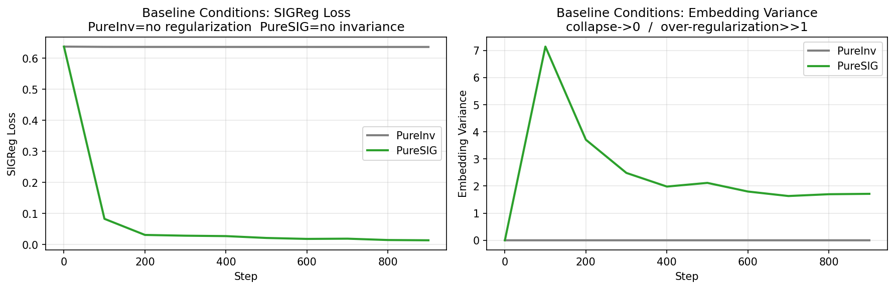
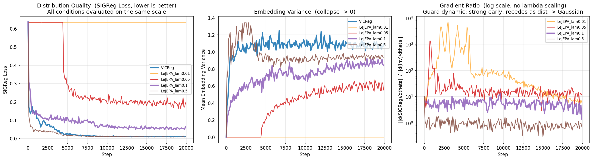

# Empirical Analysis of LeJEPA: Lambda Sweep and VICReg Comparison

---

## 1. Background

### 1.1 Self-Supervised Learning and the Collapse Problem

Self-supervised learning (SSL) trains visual representations without labeled data by requiring the encoder to produce similar embeddings for different augmented views of the same image — a property called invariance. The central challenge is representational collapse: the trivial solution where the encoder satisfies invariance by mapping all inputs to the same point. Preventing collapse without introducing fragile heuristics such as stop-gradient operations or teacher-student architectures is an open problem that has driven significant research.

### 1.2 LeJEPA, SIGReg, and the Optimality of Gaussian Embeddings

LeJEPA (Balestriero & LeCun, 2025) approaches SSL from a theoretical foundation. Starting from a bias-variance analysis of downstream task performance, Theorems 1, 7, and 8 establish that the optimal embedding distribution for SSL is an isotropic Gaussian: a distribution where every dimension carries equal information and dimensions are statistically independent. The intuition is that a spherical distribution allows any downstream linear classifier to exploit all embedding dimensions equally, minimizing generalization error. Any deviation from isotropy or Gaussianity leaves information capacity on the table.

This theoretical result motivates SIGReg, a regularizer that directly penalizes the distance between the empirical embedding distribution and a standard Gaussian. SIGReg uses the Epps-Pulley characteristic function (CF) distance: for each of many random unit directions, the embeddings are projected onto that direction, and the squared distance between the empirical CF and the Gaussian CF is measured at a grid of evaluation points. Averaging over directions gives a scalar loss that drives the full embedding distribution — not just its mean and variance — toward a Gaussian.

The total LeJEPA loss is:

```
Loss = λ × SIGReg(z) + (1 − λ) × Invariance(z)
```

where λ controls the balance between distribution regularization and view alignment. The key theoretical property of SIGReg is that it is a sufficient statistic for Gaussianity: if the CF distance is zero, the distribution is exactly Gaussian, with no shortcut solutions.

### 1.3 The Relationship Between SIGReg and VICReg

A central result in the LeJEPA paper (Section 5.2, Appendix B.14) shows that VICReg (Bardes et al., 2022) is a degenerate special case of SIGReg. When the Epps-Pulley CF distance is replaced by a statistic that matches only the first two moments — mean and standard deviation — the loss converges to VICReg in the limit of many projection directions. Formally, the degenerate statistic is:

```
T_2moment(proj) = mean(proj)² + (std(proj) − 1)²
```

This means VICReg's variance and covariance terms enforce mean ≈ 0 and std ≈ 1 per projection direction, but cannot penalize higher-order non-Gaussian structure such as skewness or excess kurtosis. Theorem 3 of the paper formalizes this as shortcut solutions: there exist many distributions satisfying VICReg's constraints that are far from Gaussian, and VICReg's loss cannot distinguish them from the optimal solution.

This theoretical relationship makes VICReg the natural baseline for comparison. Running VICReg alongside LeJEPA directly tests the practical significance of the paper's claim that sufficient moment matching is necessary for high-quality representations.

---

## 2. Experiment Design

### 2.1 Research Questions

1. Does LeJEPA with SIGReg regularization produce better downstream representations than VICReg across comparable training conditions?
2. What range of λ leads to stable training, and where are the collapse and over-regularization boundaries?
3. Does the gradient ratio between SIGReg and Invariance exhibit the "guard" dynamic predicted by the paper — strong early when the distribution is disordered, receding as the distribution approaches Gaussian?

### 2.2 Why VICReg as Baseline

A key design decision is using the original VICReg formulation (α=25, β=25, γ=1) rather than a hand-crafted degenerate variant. The paper provides a theoretical bridge between VICReg and SIGReg, making VICReg the most principled comparison point: it is a published, well-validated method with a direct theoretical connection to LeJEPA, making any performance difference interpretable in terms of the paper's claims rather than arbitrary design choices.

### 2.3 Architecture and Implementation

**Encoder.** MiniResNet-18 implemented in Equinox, a JAX-based neural network library that represents models as pure functions with no mutable state. InstanceNorm replaces BatchNorm throughout because BatchNorm requires maintaining running statistics across batches, which introduces mutable state incompatible with JAX's functional paradigm. InstanceNorm normalizes each feature map independently over its spatial dimensions and requires no batch-level bookkeeping.

```
Stem:   Conv(3→64, 3×3) + InstanceNorm + ReLU
Stage1: ResBlock(64→64,   stride=1) × 2
Stage2: ResBlock(64→128,  stride=2) × 2   [32→16]
Stage3: ResBlock(128→256, stride=2) × 2   [16→8]
Stage4: ResBlock(256→512, stride=2) × 2   [8→4]
GlobalAvgPool → ProjMLP: 512→512→512→64
```

For linear probe evaluation, the 512-dimensional backbone output before the projection head is used. This follows the standard SSL evaluation protocol: the projection head is a training artifact that maps embeddings into a space suited for the SSL loss, and the backbone features are what the encoder has actually learned.

**Data pipeline.** CIFAR-10 is loaded via `tensorflow_datasets` with a `tf.data` prefetch pipeline. PyTorch's `DataLoader` with `num_workers > 0` causes deadlocks when used with JAX due to incompatibilities between JAX's multithreaded CUDA context and Python's `os.fork()`. The `tf.data` pipeline performs data loading and augmentation in TensorFlow's C++ runtime, which does not share JAX's threading constraints, and uses `prefetch(AUTOTUNE)` to overlap CPU data preparation with GPU computation.

**Augmentation.** The pipeline follows SimCLR (Chen et al., 2020): random pad-and-crop (4-pixel padding then crop to 32×32), random horizontal flip, color jitter (brightness ±0.4, contrast 0.6–1.4×, saturation 0.6–1.4×, hue ±0.1), random grayscale (p=0.2), and CIFAR-10 normalization. RandomResizedCrop from the original SimCLR is replaced by pad-and-crop because CIFAR-10's 32×32 resolution makes aggressive scale-based cropping produce near-unrecognizable patches. Each image is augmented independently four times to produce V=4 views per image.

**Optimizer.** AdamW with warmup cosine decay: linear warmup from lr=0 to lr=1e-3 over 500 steps, followed by cosine decay to lr=1e-5 over the remaining steps, with weight decay=1e-4 and gradient clipping at global norm 1.0. The warmup is important because in the first steps, embeddings are near-random and gradients are large and unstable; ramping the learning rate gradually prevents the model from committing to a collapsed or degenerate solution before meaningful gradients are established.

### 2.4 Loss Functions

**SIGReg** computes the Epps-Pulley CF distance between projected embeddings and N(0,1). For each of 512 random unit directions (resampled each step for an unbiased estimate), embeddings are projected onto that direction, and the squared CF distance is measured at 10 evaluation points on [−4, 4]. 512 directions achieves results close to 1024 at half the computational cost. Directions are resampled each step to prevent the optimizer from exploiting fixed directions.

**VICReg** uses the original three-term formulation with paper-recommended weights α=25, β=25, γ=1, extended to V=4 views by computing the invariance term over all C(4,2)=6 view pairs and averaging the variance and covariance terms across views.

**LeJEPA** combines SIGReg and Invariance:

```
Loss = λ × SIGReg(z) + (1 − λ) × Invariance(z)
```

where Invariance is the mean MSE over all C(4,2) view pairs.

### 2.5 Experimental Conditions

All conditions use identical architecture, optimizer, and initial weights (PRNGKey(0)), isolating the loss function as the only variable.

**Baseline group (1000 steps, no linear probe):**

| Condition | Regularizer | λ |
|-----------|------------|---|
| PureInv | None | 0 |
| PureSIG | SIGReg only | 1.0 |

**Main experiment (20000 steps, linear probe evaluated after training):**

| Condition | Regularizer | λ | Grad Ratio |
|-----------|------------|---|------------|
| VICReg | Original VICReg | — | No |
| LeJEPA λ=0.01 | SIGReg | 0.01 | Yes |
| LeJEPA λ=0.05 | SIGReg | 0.05 | Yes |
| LeJEPA λ=0.1 | SIGReg | 0.1 | Yes |
| LeJEPA λ=0.5 | SIGReg | 0.5 | Yes |

### 2.6 Evaluation Metrics

**SIGReg loss** serves as the unified distribution quality metric across all conditions, including VICReg where it is computed only for evaluation and does not influence training. This allows all conditions to be assessed on the same scale.

**Invariance loss** measures view alignment quality: the mean MSE between embeddings of different views of the same image.

**Embedding variance** detects collapse; a value approaching zero indicates all embeddings have converged to a single point.

**Gradient ratio** (‖∂SIGReg/∂θ‖ / ‖∂Inv/∂θ‖, without λ scaling) quantifies the natural scale competition between the regularizer and the invariance signal, computed on a 64-sample sub-batch every 100 steps.

**Linear probe accuracy** on CIFAR-10: frozen 512-dim backbone features, linear classifier (512→10) trained for 100 epochs with AdamW, evaluated on the test set.

---

## 3. Results

### 3.1 Baseline Group: Degenerate Endpoints

The two baseline conditions establish the behavioral boundaries of the loss function.

**PureInv (λ=0)** collapsed immediately. Embedding variance reached zero by step 500 and SIGReg loss remained fixed at 0.636 for the entire 1000 steps. With no regularization, the invariance loss is minimized trivially by mapping all embeddings to a single point.

**PureSIG (λ=1.0)** showed the opposite extreme. SIGReg loss decreased rapidly to 0.015, approaching a Gaussian distribution, but embedding variance peaked at 7.1 before stabilizing near 1.8. Without an invariance term, the encoder has no incentive to align different views of the same image, producing embeddings that are well-distributed but semantically unaligned. The warmup schedule visibly reduced the initial variance spike compared to training with a fixed learning rate.

Together these conditions confirm that both terms of the LeJEPA loss are necessary: regularization alone cannot produce useful representations, and invariance alone leads to collapse.



### 3.2 Training Dynamics

**VICReg** trained stably from the start. SIGReg loss dropped sharply in the first 3000 steps from 0.636 to below 0.1, and continued declining to 0.011 by step 19500 — the lowest final SIGReg value among all conditions. Embedding variance stabilized around 1.0–1.1, close to the unit Gaussian target. The cosine decay schedule visibly helped: loss continued to decrease slowly throughout the later stages of training rather than plateauing.

**LeJEPA λ=0.01** collapsed completely and never recovered. Embedding variance was zero at every logged step throughout all 20000 steps, and SIGReg loss remained fixed at 0.635. The gradient ratio oscillated between 10² and 10⁴, reflecting unstable gradient estimates in the collapsed state. After λ=0.01 scaling, SIGReg's effective contribution to parameter updates was approximately 6% of the invariance gradient — insufficient to overcome the collapse basin. Linear probe accuracy of 10.00% equals random chance on CIFAR-10.

**LeJEPA λ=0.05** collapsed for the first 4500 steps, then escaped. From step 0 to 4500, embedding variance was zero and SIGReg loss was fixed at 0.635. At approximately step 4500, the model escaped the collapse basin, after which SIGReg loss declined from 0.365 to approximately 0.19 and embedding variance grew to 0.55. The escape mechanism appears stochastic: the warmup schedule causes the effective learning rate to be low in the first 500 steps, which may delay but not prevent collapse for this λ value. The final gradient ratio of 11.7 suggests that after escape, SIGReg's effective contribution was approximately 59% of the invariance term — enough to maintain the escaped state but not enough to prevent the initial collapse.

**LeJEPA λ=0.1** trained stably from the start with no collapse. SIGReg loss declined continuously from 0.636 to 0.064, and embedding variance grew smoothly from zero to approximately 0.84. Of all LeJEPA conditions, this one had the lowest invariance loss (0.0055), indicating the best view alignment. The final gradient ratio of 1.40 shows that by the end of training, SIGReg's raw gradient magnitude was 1.4× the invariance gradient; after λ=0.1 scaling, its effective contribution was 14% of the invariance term.

**LeJEPA λ=0.5** trained stably but with a different character. SIGReg loss fell fastest of all conditions, reaching 0.009 by step 19500. Embedding variance stabilized around 0.9–1.0, the closest to unit Gaussian among all conditions. However, invariance loss (0.0129) was substantially higher than LeJEPA λ=0.1 (0.0055), indicating that the stronger regularization signal came at the cost of view alignment quality. The final gradient ratio of 0.74 — below 1.0 — means SIGReg's raw gradient was actually weaker than the invariance gradient by step 20000, with λ=0.5 scaling making SIGReg's effective contribution 37% of the invariance term.

### 3.3 Gradient Ratio Analysis

The gradient ratio curves provide direct evidence for the "guard" dynamic described in the paper. For LeJEPA λ=0.1 and λ=0.5, the ratio starts high in the first few thousand steps and then stabilizes at a lower plateau, consistent with the prediction that SIGReg gradients are strong when the distribution is disordered and weaken as it approaches Gaussian.

For λ=0.05, the gradient ratio during the collapse phase (steps 0–4500) oscillates violently between 10² and 10³, reflecting the instability of gradient estimates near the collapsed state. After escape, the ratio drops rapidly to around 10 and stabilizes, matching the behavior of the λ=0.1 condition.

For λ=0.01, the ratio remains in the 10²–10⁴ range throughout training, never stabilizing, confirming that the collapsed state prevents the guard dynamic from ever establishing itself.

The stable final gradient ratios across conditions — approximately 6 for λ=0.01 (in collapse), 12 for λ=0.05 (after escape), 1.4 for λ=0.1, and 0.74 for λ=0.5 — form a monotone decreasing sequence with λ. This indicates that higher λ values result in stronger regularization pressure relative to the invariance signal at every point in training, not just through the explicit λ weighting.



### 3.4 Linear Probe Results

| Condition | SIGReg (final) | Inv Loss (final) | Emb Var (final) | Grad Ratio (final) | Test Acc |
|-----------|---------------|-----------------|-----------------|-------------------|----------|
| VICReg | 0.011 | 0.0236 | 1.094 | N/A | 54.83% |
| LeJEPA λ=0.01 | 0.635 | 0.000 | 0.000 | 6.20 | 10.00% |
| LeJEPA λ=0.05 | 0.195 | 0.003 | 0.553 | 11.71 | 45.13% |
| LeJEPA λ=0.1 | 0.064 | 0.006 | 0.840 | 1.40 | **59.95%** |
| LeJEPA λ=0.5 | 0.009 | 0.013 | 0.938 | 0.74 | 61.97% |

LeJEPA λ=0.1 and λ=0.5 both outperform VICReg by a substantial margin (5–7 percentage points), while LeJEPA λ=0.05 underperforms VICReg due to the 4500 steps lost to collapse.

### 3.5 The Dissociation Between SIGReg Loss and Downstream Accuracy

The most striking finding is the dissociation between SIGReg loss and linear probe accuracy in the VICReg condition. VICReg achieves the lowest SIGReg loss among all conditions (0.011), yet its test accuracy (54.83%) is lower than both LeJEPA λ=0.1 (59.95%) and λ=0.5 (61.97%), both of which have substantially higher SIGReg loss values.

The explanation lies in invariance loss. VICReg's invariance loss at the end of training is 0.0236 — more than four times higher than LeJEPA λ=0.1's 0.0055. VICReg's three-term loss structure does not explicitly minimize the mean squared distance between different views of the same image with the same directness that LeJEPA's invariance term does; its covariance and variance terms compete with invariance for the optimizer's attention. As a result, VICReg produces embeddings that are well-distributed in shape (low SIGReg loss) but poorly aligned across views (high invariance loss). A linear classifier trained on these embeddings sees features that vary within a class, reducing its ability to generalize.

This suggests that for predicting downstream linear probe accuracy in this setting, invariance loss is a better indicator than SIGReg loss. Distribution quality is necessary but not sufficient; view alignment quality matters at least as much.

---

## 4. Conclusions

### 4.1 Main Findings

The central question — whether LeJEPA with SIGReg outperforms VICReg — is answered conditionally: yes, when λ is large enough to prevent collapse.

**Lambda behavior zones.** Four distinct regimes emerged from the sweep:

| Zone | Lambda | Behavior |
|------|--------|----------|
| Collapse | λ ≤ 0.01 | Immediate and permanent collapse, emb_var → 0, test acc = 10% |
| Critical | λ = 0.05 | Delayed escape (~4500 steps), stochastic, warmup does not reliably prevent it |
| Stable | λ = 0.1 | No collapse, best view alignment, competitive accuracy |
| High-reg | λ = 0.5 | Fastest distribution convergence, highest accuracy in this run, but inv loss elevated |

**VICReg as a stronger-than-expected baseline.** With warmup cosine decay, VICReg achieves a final SIGReg loss of 0.011 — the lowest among all conditions — demonstrating that VICReg's implicit regularization can produce well-distributed embeddings given sufficient training steps and a good schedule. However, its invariance loss is more than four times higher than the best LeJEPA condition, and its test accuracy is 5–7 points lower. This suggests VICReg's loss structure creates a tension between its three terms that leaves view alignment under-optimized compared to the explicit invariance term in LeJEPA.

**SIGReg loss does not fully predict downstream performance.** Distribution quality (SIGReg) and view alignment quality (invariance loss) both contribute to linear probe accuracy, and in this experiment invariance loss is the stronger predictor. A model can have excellent distribution quality and mediocre downstream performance if its views are poorly aligned.

**Gradient ratio confirms the guard dynamic.** For stable LeJEPA conditions (λ=0.1 and λ=0.5), the gradient ratio starts high and decreases to a stable plateau, directly quantifying the paper's description of SIGReg as a "guard": strong when the distribution is disordered, receding as it approaches Gaussian.

### 4.2 Limitations of This Experiment

**Insufficient training steps.** 20000 steps on CIFAR-10 with batch size 512 corresponds to approximately 200 epochs. SSL models typically require 800–1000 epochs to converge fully. The ordering of conditions by test accuracy — particularly the result that λ=0.5 outperforms λ=0.1 — may reflect differences in convergence speed rather than final performance. A fully converged run could reverse this ordering if the stronger regularization in λ=0.5 eventually suppresses invariance to a degree that hurts downstream accuracy.

**Single seed.** Each condition was run once from the same initialization. The stochastic collapse escape observed in λ=0.05 (occurring at step ~4500 in this run) demonstrates that some conditions are sensitive to the specific trajectory of stochastic gradient descent. Without multiple seeds, it is impossible to characterize the variance of these results or determine whether the escape is reliable or coincidental.

**Dataset and architecture constraints.** CIFAR-10's 32×32 resolution limits the richness of features the encoder can learn. The pad-and-crop augmentation used in place of RandomResizedCrop is a compromise imposed by the small image size. Results may not generalize to higher-resolution datasets where SSL methods typically achieve higher absolute accuracy.

**No tracking of VICReg's internal terms.** VICReg's variance, invariance, and covariance terms are not logged separately, making it difficult to diagnose precisely why its invariance loss is higher than LeJEPA's. Tracking these terms would provide a more complete picture of VICReg's training dynamics.

### 4.3 Future Work

The most impactful improvement would be extending training to 50000–100000 steps to approach convergence, which would clarify whether λ=0.5 maintains its accuracy advantage or whether λ=0.1 eventually surpasses it. Running each condition with at least 3 seeds would quantify the variance of results and make the λ=0.05 collapse escape statistically meaningful.

Adding λ=0.25 to the sweep would fill the gap between the stable and high-regularization zones, where the transition in invariance loss behavior is most interesting. Logging VICReg's three-term loss decomposition would allow a more complete comparison of how each method's internal terms evolve. Finally, repeating the experiment on a higher-resolution dataset such as STL-10 or ImageNette would test whether the findings generalize beyond CIFAR-10.

---

## References

[1] Balestriero, R. & LeCun, Y. (2025). LeJEPA: Provable and Scalable Self-Supervised Learning Without the Heuristics. *arXiv:2511.08544*.

[2] Bardes, A., Ponce, J., & LeCun, Y. (2022). VICReg: Variance-Invariance-Covariance Regularization for Self-Supervised Learning. *ICLR 2022*.

[3] Chen, T., Kornblith, S., Norouzi, M., & Hinton, G. (2020). A Simple Framework for Contrastive Learning of Visual Representations. *ICML 2020*.

[4] Epps, T. W. & Pulley, L. B. (1983). A test for normality based on the empirical characteristic function. *Biometrika, 70*(3), 723–726.
