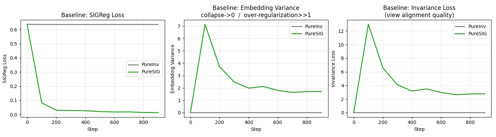
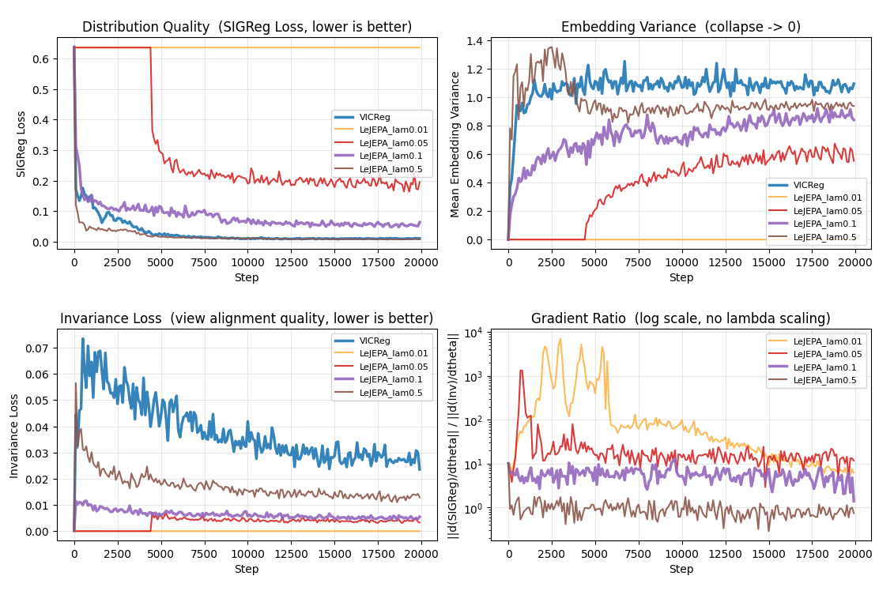

# Testing the Theoretical Claims of LeJEPA: A Lambda Sweep and VICReg Comparison

---

## 1. Background

### 1.1 Self-Supervised Learning

Self-supervised learning (SSL) trains visual representations without labeled data. The core idea is to define a pretext task directly from the data itself: the same image is augmented in two or more different ways, and the encoder is trained to produce similar embeddings for all augmented versions of the same image. This property is called invariance.

The central challenge is representational collapse — the trivial solution where the encoder satisfies invariance by mapping every image to the same point in embedding space. Preventing collapse without introducing fragile engineering tricks (stop-gradient, momentum encoders, large batch sizes) is the key open problem that motivates both VICReg and LeJEPA.

### 1.2 Linear Probe

Linear probe is the standard evaluation protocol for SSL representations. After SSL training completes, the encoder weights are frozen and a single linear layer (512→10 for CIFAR-10) is trained on top of the backbone features using labeled data. The test accuracy of this linear classifier measures how much useful information the encoder has learned to represent.

The probe is applied to the 512-dimensional backbone output before the projection head, not the 64-dimensional projected embeddings. The projection head is a training artifact that maps embeddings into a space suited for the SSL loss objective; it is discarded at evaluation time. The backbone features are what the encoder has actually learned about the images.

### 1.3 LeJEPA and SIGReg

LeJEPA (Balestriero & LeCun, 2025) starts from a bias-variance analysis of downstream task performance. Theorems 1, 7, and 8 establish that the optimal embedding distribution for SSL is an **isotropic Gaussian**: every dimension carries equal information, and dimensions are statistically independent. The intuition is that a spherical distribution allows any downstream linear classifier to exploit all embedding dimensions equally, minimizing generalization error.

This theoretical result motivates **SIGReg**, which directly penalizes the distance between the empirical embedding distribution and N(0,1). The computation proceeds in three steps:

1. **Cramér-Wold reduction**: By the Cramér-Wold theorem, a multivariate distribution equals N(0,I) if and only if every one-dimensional projection is N(0,1). This reduces the high-dimensional problem to many one-dimensional tests.
2. **Random projection**: 512 random unit directions are sampled. Embeddings are projected onto each direction to produce a scalar distribution.
3. **Epps-Pulley CF distance**: For each projection, the squared distance between the empirical characteristic function and the Gaussian CF (exp(−t²/2)) is measured at 10 evaluation points on [−4, 4] and averaged.

The total LeJEPA loss is:

```
Loss = λ × SIGReg(z) + (1 − λ) × Invariance(z)
```

λ controls the balance between distribution regularization and view alignment. Unlike VICReg's three separate weighted terms, LeJEPA has a single hyperparameter with a clear interpretation: how much of the optimizer's attention goes to shaping the distribution versus aligning views.

### 1.4 VICReg

VICReg (Bardes et al., 2022) prevents collapse through three simultaneously applied constraints:

| Term | Formula | Purpose |
|------|---------|---------|
| Variance | mean over dims of max(0, 1 − std(z_j)) | Penalizes std < 1 per dimension; directly prevents collapse |
| Invariance | mean MSE between views | Pulls different views of the same image together |
| Covariance | sum of squared off-diagonal covariance entries / D | Decorrelates dimensions; prevents information redundancy |

The variance term is the anti-collapse mechanism: when all embeddings collapse to a point, every dimension has std ≈ 0, making the hinge loss large. The covariance term goes further than just requiring spread — it requires that different dimensions capture different information.

VICReg uses paper-recommended weights α=25, β=25, γ=1.

**The theoretical limitation.** VICReg's variance and covariance terms together enforce mean ≈ 0, std ≈ 1, and low linear correlation per projection direction. This is 2-moment matching. Theorem 3 in the LeJEPA paper formalizes that this is insufficient: many distributions satisfy these constraints while being far from Gaussian (e.g., uniform, bimodal, heavy-tailed distributions with matched moments). These are shortcut solutions — VICReg cannot distinguish them from the optimal Gaussian.

LeJEPA Appendix B.14 proves that when the Epps-Pulley statistic is replaced by a 2-moment statistic (mean² + (std−1)²), the SIGReg loss converges to VICReg in the limit of many projection directions. VICReg is therefore a degenerate special case of SIGReg, making it the most theoretically principled baseline for this experiment.

### 1.5 CIFAR-10

CIFAR-10 is a standard image classification benchmark: 10 classes, 50,000 training images, 10,000 test images, 32×32 pixels. It is chosen for this experiment because it is lightweight (fast to load and train on), requires no special setup (available via `tensorflow_datasets`), and is sufficient for a concept-validation experiment focused on relative comparisons between conditions rather than absolute accuracy.

The 32×32 resolution is a limitation: it constrains the richness of features the encoder can learn and requires a simplified augmentation strategy (pad-and-crop rather than RandomResizedCrop). Results may not generalize to higher-resolution settings.

### 1.6 Augmentation

Four operations applied independently four times per image to produce V=4 different views

Pad-and-crop: pad 4 pixels on each side to 40×40, then randomly crop back to 32×32. Forces the model to be invariant to the spatial position of objects within the image.

Random horizontal flip: 50% probability of left-right flip. Forces the model to treat mirrored images as semantically equivalent.

Color jitter: randomly adjust brightness, contrast, saturation, and hue, with 20% probability of converting to grayscale. Forces the model to rely on shape and texture rather than absolute color values.

Normalize: subtract CIFAR-10 channel means and divide by standard deviations. Stabilizes gradient magnitudes during training.

The pipeline follows SimCLR (Chen et al. 2020). The core design principle is that two views of the same image should be different enough to make the task non-trivial, but similar enough that the model can still find the correspondence. Augmentations that are too weak allow shortcut solutions; augmentations that are too aggressive destroy the semantic content needed for learning.

### 1.7 MiniResNet-18

MiniResNet-18 is a lightweight ResNet-18 adapted for 32×32 CIFAR-10 input. The architecture:

```
Stem:   Conv(3→64, 3×3) + InstanceNorm + ReLU
Stage1: ResBlock(64→64,   stride=1) × 2
Stage2: ResBlock(64→128,  stride=2) × 2   [32→16]
Stage3: ResBlock(128→256, stride=2) × 2   [16→8]
Stage4: ResBlock(256→512, stride=2) × 2   [8→4]
GlobalAvgPool → (512,)
```

**InstanceNorm instead of BatchNorm.** BatchNorm maintains running statistics across batches — mutable state that is incompatible with JAX's functional programming model, where functions must be pure (no side effects). InstanceNorm normalizes each feature map independently over its spatial dimensions within a single sample, requiring no batch-level bookkeeping. This makes the model a pure function: given the same input and weights, it always produces the same output, which is required for JAX's JIT compilation and automatic differentiation.

The model exposes two forward methods: `encode()` returns the 512-dim backbone features used for linear probe; `__call__()` applies the full forward pass including the projection head, used during SSL training.

### 1.8 JAX and Equinox

**JAX** is a numerical computing library designed for high-performance machine learning research. Its core design principles are relevant to this experiment:

- `jit`: compiles Python functions to optimized XLA programs, fusing operations into single GPU kernels
- `vmap`: vectorizes functions over a batch dimension without explicit loops
- `grad`: computes exact gradients of any differentiable function

These transforms compose cleanly and require functions to be pure, which motivated the choice of InstanceNorm and the functional training loop design.

**Equinox** is a JAX-based neural network library that represents models as pytrees of arrays — pure data structures with no hidden state. This makes models composable with all JAX transforms naturally.


**Warmup cosine decay** uses a two-phase learning rate schedule:

```
Steps 0–500:     linear ramp from 0 to peak lr (1e-3)
Steps 500–20000: cosine decay from peak lr to end lr (1e-5)
```

The warmup phase is important for SSL training: in the first steps, embeddings are near-random and gradients are large and unstable. A full learning rate from step 0 can push the model into a collapsed or degenerate state before meaningful gradient information is available. Ramping the learning rate gradually gives the model time to establish a reasonable embedding distribution before committing to large parameter updates. The cosine decay phase allows fine-grained refinement as the model approaches convergence.


---

## 2. Experiment Design

### 2.1 Overall Architecture and Design Philosophy

The guiding principle is **simplicity**: use the smallest, fastest components that can clearly answer the research questions. Every design choice prioritizes interpretability of results over absolute performance.

**SSL Training Pipeline**

```
CIFAR-10 images
    └─ SimCLR augmentation × 4 views              (N, 4, 3, 32, 32)
        └─ MiniResNet-18 backbone
           in : (3, 32, 32) per image
           out: (512,) per image
                └─ Projection Head  MLP 512→512→512→64
                   in : (512,)
                   out: (64,)
                        └─ Embeddings              (4, N, 64)
                            └─ SSL Loss (VICReg or LeJEPA)
                                └─ AdamW + warmup cosine decay
                                   (500-step warmup, lr 0→1e-3→1e-5)
```

V=4 views per image provides C(4,2)=6 view pairs for the invariance term,
giving a more stable gradient estimate than the standard V=2 used in the
original papers.

**Linear Probe Evaluation Pipeline**

```
CIFAR-10 images
    └─ Normalize only, no augmentation                 (N, 3, 32, 32)
        └─ MiniResNet-18 backbone (frozen weights)
           in : (3, 32, 32) per image
           out: (512,) per image
                └─ Pre-extracted feature matrix        (N, 512)
                    └─ LinearProbe  512→10
                       trained 100 epochs, AdamW
                            └─ Top-1 test accuracy on CIFAR-10
```

The projection head is discarded at evaluation time. The backbone's 512-dim
output is used instead, following the standard SSL evaluation protocol:
the projection head is a task-specific adapter optimized for the SSL loss
geometry, while the backbone features reflect what the encoder has genuinely
learned about the visual content of the images.

### 2.2 Evaluation Metrics

Four metrics are recorded every 100 steps during training, plus a final linear probe after training completes.

| Metric | What it measures | What to look for |
|--------|-----------------|-----------------|
| SIGReg loss | Distance from embedding distribution to N(0,1) | Lower = more Gaussian distribution |
| Invariance loss | Mean MSE between different views of the same image | Lower = better view alignment |
| Embedding variance | Mean variance per embedding dimension | Near 0 = collapse; near 1 = healthy |
| Gradient ratio | ‖∂SIGReg/∂θ‖ / ‖∂Inv/∂θ‖ (no λ scaling) | Quantifies natural scale competition |

SIGReg loss is applied to **all conditions** including VICReg as a unified evaluation metric, even though VICReg never optimizes it directly. This design choice is critical: it allows all conditions to be compared on the same scale. If each condition were evaluated by its own training loss, the numbers would be incomparable.

The gradient ratio is computed without λ scaling to reveal the natural scale relationship between the two loss terms, separate from the weighting imposed by λ. A ratio of 10 means SIGReg's gradient is 10× stronger than Invariance's before any scaling. This quantifies the paper's claim that SIGReg acts as a "guard" — strong when the distribution is disordered, receding as it approaches Gaussian.

**Linear probe accuracy** is the final downstream evaluation, measuring the real-world utility of the learned representations on CIFAR-10 classification.

### 2.3 Experimental Conditions

Conditions are split into two groups to keep the main experiment plots readable. PureInv and PureSIG produce extreme values (emb_var → 0 or >> 1) that would compress the y-axis and obscure differences between the main conditions.

**Baseline group (1000 steps, no linear probe):**

| Condition | Regularizer | λ | Purpose |
|-----------|------------|---|---------|
| PureInv | None | 0 | Confirms collapse without regularization |
| PureSIG | SIGReg only | 1.0 | Shows distribution quality without view alignment |

1000 steps is sufficient to observe collapse (PureInv) and the emb_var explosion (PureSIG). Continuing further adds no new information.

**Main experiment (20000 steps, linear probe after training):**

| Condition | Regularizer | λ | Expected behavior |
|-----------|------------|---|-------------------|
| VICReg | VICReg (α=25, β=25, γ=1) | — | Stable training, 2-moment matching |
| LeJEPA λ=0.01 | SIGReg | 0.01 | Collapse (SIGReg too weak) |
| LeJEPA λ=0.05 | SIGReg | 0.05 | Near collapse threshold |
| LeJEPA λ=0.1 | SIGReg | 0.1 | Stable zone |
| LeJEPA λ=0.5 | SIGReg | 0.5 | Strong regularization |

The four λ values are chosen to sample the key behavioral zones: below the collapse threshold (0.01), at the threshold (0.05), in the stable zone (0.1), and at the edge of over-regularization (0.5). All conditions share the same initial weights (PRNGKey(0)) and optimizer settings, isolating the loss function as the only variable.

---

## 3. Results

### 3.1 Baseline Group



**PureInv** collapsed immediately. Embedding variance reached zero by step 500, SIGReg loss fixed at 0.636, and invariance loss fixed at 0.000. The zero invariance loss is trivially achieved: when all embeddings collapse to a single point, the distance between any two views is exactly zero. This is the degenerate solution the regularizer exists to prevent.

**PureSIG** showed the opposite extreme. SIGReg loss fell to 0.015, but embedding variance peaked at 7.1 before stabilizing near 1.8. The invariance loss peaked at ~13 at step 100 before declining to ~3 by the end of training.

Together these conditions confirm that both terms are necessary: regularization without invariance produces embeddings with no semantic structure, and invariance without regularization produces collapsed embeddings.

### 3.2 Training Dynamics



**VICReg** trained stably throughout. SIGReg loss dropped from 0.636 to 0.011 — the lowest final value among all conditions — and embedding variance stabilized near 1.0. However, the invariance loss (bottom-left panel) tells a different story: starting at ~0.07 and declining only to ~0.025 by step 20000, VICReg consistently has the highest invariance loss among all non-collapsed conditions throughout training. The three-term loss structure creates internal competition between the variance, invariance, and covariance terms, leaving invariance chronically under-optimized relative to LeJEPA's dedicated (1−λ) weighting.

**LeJEPA λ=0.01** collapsed completely and permanently. All metrics are fixed throughout: emb_var=0, SIGReg=0.635, invariance loss=0, gradient ratio oscillating between 10² and 10⁴. The zero invariance loss is trivial — a consequence of collapse, not alignment. The gradient ratio never stabilizes, confirming that the collapse state prevents any coherent training signal from establishing itself. After λ=0.01 scaling, SIGReg's effective contribution is approximately 6% of the invariance gradient, insufficient to break the collapse attractor.

**LeJEPA λ=0.05** collapsed for the first ~4500 steps, during which invariance loss was trivially zero. At ~step 4500 the model escaped: the invariance loss spiked sharply to ~0.05 — momentarily the highest among all conditions — as embeddings spread out and views became distinguishable for the first time. From that point, the invariance term pulled the loss down to ~0.005. The gradient ratio dropped simultaneously from the 10²–10³ collapse range to ~12, matching the behavior of stable conditions. The spike-then-descent in invariance loss combined with the ratio drop is the clearest visual signature of the escape event.

**LeJEPA λ=0.1** trained stably from step 0. Invariance loss settled to ~0.007, the lowest sustained value among all non-trivially-zero conditions. The gradient ratio stabilized at ~1.4, meaning SIGReg's raw gradient was only 1.4× the invariance gradient — a balanced competition. SIGReg loss declined continuously to 0.064 and embedding variance reached 0.84.

**LeJEPA λ=0.5** showed the highest initial invariance loss among stable conditions (~0.055 at step 100), reflecting the strong SIGReg pressure that initially dominates training and deprioritizes view alignment. The invariance loss then declined to ~0.014 and the gradient ratio stabilized near 0.74 — meaning by the end of training SIGReg's raw gradient was actually weaker than invariance, yet λ=0.5 kept it as the dominant effective contributor. SIGReg loss reached the lowest final value (0.009).

The final gradient ratios form a monotone decreasing sequence with λ, confirming that higher λ produces stronger regularization pressure at every point in training, not just through explicit weighting:
| Condition | Grad Ratio (final) | Effective SIGReg contribution (grad ratio * λ) |
|-----------|-------------------|-----------------------------------------|
| LeJEPA λ=0.01 | 6.20 | ~6% of Inv |
| LeJEPA λ=0.05 | 11.71 | ~59% of Inv |
| LeJEPA λ=0.1 | 1.40 | ~14% of Inv |
| LeJEPA λ=0.5 | 0.74 | ~37% of Inv |

### 3.3 Linear Probe Results

| Condition | SIGReg (final) | Inv Loss (final) | Emb Var (final) | Test Acc |
|-----------|---------------|-----------------|-----------------|----------|
| VICReg | 0.011 | 0.024 | 1.094 | 54.83% |
| LeJEPA λ=0.01 | 0.635 | 0.000 | 0.000 | 10.00% |
| LeJEPA λ=0.05 | 0.195 | 0.003 | 0.553 | 45.13% |
| LeJEPA λ=0.1 | 0.064 | 0.006 | 0.840 | **59.95%** |
| LeJEPA λ=0.5 | 0.009 | 0.013 | 0.938 | **61.97%** |

LeJEPA λ=0.1 and λ=0.5 both outperform VICReg by 5–7 percentage points. LeJEPA λ=0.05 underperforms VICReg due to the ~4500 steps lost to collapse. LeJEPA λ=0.01 achieves random chance, confirming that collapse completely destroys representational utility.

### 3.4 Conclusion

**SIGReg loss does not fully predict downstream accuracy.** VICReg achieves the lowest final SIGReg loss (0.011) yet lower test accuracy than LeJEPA λ=0.1 and λ=0.5. The invariance loss explains this: VICReg's invariance loss (0.024) is four times higher than LeJEPA λ=0.1 (0.006) and nearly twice that of λ=0.5 (0.013). The result is embeddings that are well-distributed in shape but insufficiently aligned across views. In this experiment, invariance loss is a stronger predictor of downstream accuracy than SIGReg loss among non-collapsed conditions.

**The λ=0.5 accuracy advantage** is likely a consequence of the limited training budget. Stronger SIGReg pressure accelerates distribution convergence, allowing the backbone to learn more structured features within 20000 steps. Whether this advantage persists at convergence is unknown — λ=0.1's better view alignment may allow it to surpass λ=0.5 given a longer training run.

**The collapse escape at λ=0.05** is visible as a sharp invariance loss spike from 0 to ~0.05 at step ~4500, followed by rapid decline to ~0.005. This spike occurs because embeddings suddenly spread out, making different views distinguishable for the first time. The warmup schedule did not reliably prevent this collapse.

These observations map onto four distinct behavioral zones:

| Zone | Lambda | Behavior |
|------|--------|----------|
| Collapse | λ ≤ 0.01 | Permanent collapse, emb_var → 0, test acc = random |
| Critical | λ = 0.05 | Stochastic escape (~step 4500), warmup does not reliably prevent it |
| Stable | λ = 0.1 | No collapse, best view alignment, competitive accuracy |
| High-reg | λ = 0.5 | Fastest distribution convergence, highest accuracy in this run |

LeJEPA outperforms VICReg when λ is large enough to prevent collapse. The 5–7 percentage point advantage at λ=0.1 and λ=0.5 supports the paper's claim that sufficient moment matching produces better representations than 2-moment matching. The gradient ratio confirms the guard dynamic: SIGReg is strongest when the distribution is disordered and recedes as it approaches Gaussian.

### 3.5 Limitations and Future Work

**Insufficient training steps.** 20000 steps corresponds to ~200 epochs — well below the 800–1000 epochs at which SSL models typically converge. The λ=0.5 accuracy advantage and the ordering of conditions may reflect convergence speed rather than final performance.

**Single seed.** The stochastic collapse escape at λ=0.05 shows that some conditions are sensitive to the specific gradient trajectory. Without multiple seeds, the variance of results cannot be quantified.

**Directions for improvement:** extending training to 50000–100000 steps; running 3+ seeds per condition; adding λ=0.25, 0.75 to fill the gap between stable and high-regularization zones; logging VICReg's internal terms; testing on STL-10 or ImageNette for higher-resolution validation.

---

## References

1. Balestriero, R. & LeCun, Y. (2025). LeJEPA: Provable and Scalable Self-Supervised Learning Without the Heuristics. *arXiv:2511.08544*.
2. Bardes, A., Ponce, J., & LeCun, Y. (2022). VICReg: Variance-Invariance-Covariance Regularization for Self-Supervised Learning. *ICLR 2022*.
3. Chen, T., Kornblith, S., Norouzi, M., & Hinton, G. (2020). A Simple Framework for Contrastive Learning of Visual Representations. *ICML 2020*.
4. Epps, T. W. & Pulley, L. B. (1983). A test for normality based on the empirical characteristic function. *Biometrika, 70*(3), 723–726.
